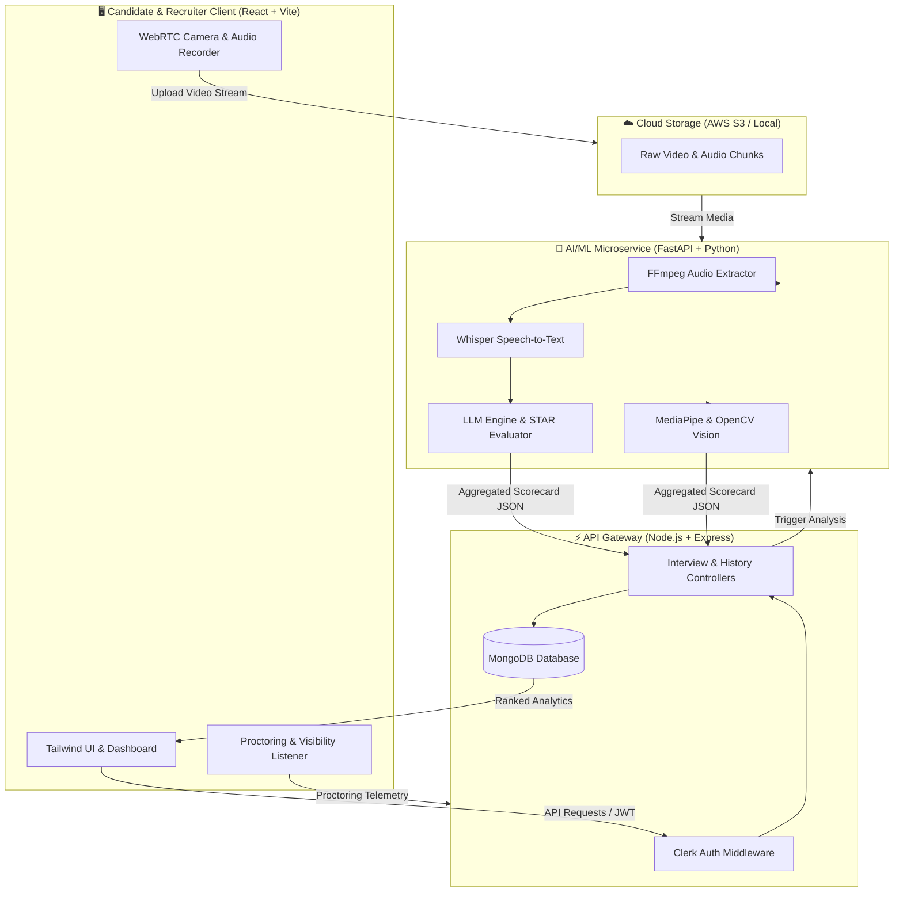

<div align="center">

# 🎙️ Debrief.ai
### *AI-Powered Video Interview, Screening & Proctoring Platform*

[](https://reactjs.org/)
[](https://fastapi.tiangolo.com/)
[](https://nodejs.org/)
[](https://openai.com/)
[](https://developers.google.com/mediapipe)
[](https://tailwindcss.com/)
[](https://www.mongodb.com/)
[](https://clerk.com/)

<p align="center">
  <a href="#-overview">Overview</a> •
  <a href="#-core-problem--solution">Problem & Solution</a> •
  <a href="#-key-features">Features</a> •
  <a href="#-system-architecture">Architecture</a> •
  <a href="#-phased-implementation-roadmap">Roadmap</a> •
  <a href="#-tech-stack">Tech Stack</a> •
  <a href="#-repository-structure">Structure</a> •
  <a href="#-quick-start">Quick Start</a> •
  <a href="#-api-reference">API Docs</a>
</p>

---

</div>

## 🌟 Overview

**Debrief.ai** is an intelligent AI video interviewing, candidate assessment, and proctoring platform. It bridges the gap between candidates seeking structured interview practice and hiring teams looking to automate high-volume first-round screenings.

By combining **in-browser WebRTC video streaming**, **MediaPipe computer vision**, **OpenAI Whisper speech transcription**, and **LLM-driven psycholinguistic analysis**, Debrief.ai delivers objective scoring, cheating prevention, and 360° candidate scorecards in real time.

---

## 🎯 Core Problem & Solution

| 🚨 The Challenge | 💡 The Debrief.ai Solution |
|:---|:---|
| **Recruiter Screening Fatigue:** Reviewing hundreds of resumes and conducting repetitive 30-minute introductory calls wastes dozens of engineering and HR hours every week. | **Asynchronous AI Video Screening:** Recruiters share custom interview links; candidates record answers asynchronously; AI scores, transcribes, and ranks all submissions out of 100. |
| **Zero Actionable Feedback for Candidates:** Over 85% of applicants receive silent rejections without insights into their communication clarity or structure. | **Instant Multi-Modal Coaching:** Granular breakdown of STAR structure, speech cadence (WPM), filler word usage, body language, and AI-optimized sample answers. |
| **Remote Interview Dishonesty:** Script-reading, AI prompting during questions, tab switching, and unauthorized assistance. | **Multi-Layered AI Proctoring:** Real-time gaze and attention tracking, multiple-face detection, background voice alerts, and browser focus event logging. |

---

## ✨ Key Features

```
                   ┌──────────────────────────────────────────────┐
                   │               DEBRIEF.AI CORE                │
                   └──────────────────────┬───────────────────────┘
          ┌───────────────────────────────┼───────────────────────────────┐
          ▼                               ▼                               ▼
  📹 Video & Vision AI          🎙️ Speech & NLP AI              🛡️ Smart Proctoring
  • In-browser WebRTC rec       • Whisper speech-to-text        • Tab-switch tracking
  • Gaze & eye-contact score    • WPM & speech cadence          • Multi-face detection
  • Facial emotion cues         • Filler word density           • Background noise alerts
  • Head-pose estimation        • STAR method evaluation        • Integrity score metric
```

### 1. 📹 Computer Vision & Behavioral Analytics
- **HD In-Browser WebRTC Capture:** Seamless recording directly inside the browser using standard `MediaRecorder` APIs with no software downloads required.
- **Attention & Eye-Tracking:** Computer vision pipeline tracks face landmarks and calculates gaze direction to detect off-screen script reading.
- **Facial Emotion & Confidence Telemetry:** Real-time estimation of confidence, composure, and emotional indicators across each question.

### 2. 🧠 Speech Intelligence & STAR Methodology
- **Whisper Speech-to-Text:** Accurate transcription across diverse accents, background noise, and specialized technical terminology.
- **Vocal Metrics:** Automatic tracking of Words Per Minute (WPM), speech velocity, pause frequencies, and filler word distribution (`um`, `like`, `basically`, `actually`).
- **STAR Structural Grading:** Answers are parsed and graded across **Situation**, **Task**, **Action**, and **Result** components.
- **AI Answer Enhancement:** Generates an optimized, highly articulate version of the candidate's answer for constructive review.

### 3. 🛡️ Smart Proctoring & Anti-Cheat Suite
- **Focus & Tab-Switch Auditing:** Listens to `visibilitychange` events and logs timestamped off-tab excursions.
- **Multi-Person Detection:** Flags if extra faces appear in the camera frame.
- **Ambient Voice & Integrity Scoring:** Aggregates proctoring flags into an automated candidate integrity rating.

### 4. 📊 Recruiter CRM & Intelligence Dashboard
- **Algorithmic Ranking:** Automatic candidate sorting by composite AI Hiring Score.
- **Radar & Skill Visualizations:** Interactive charts depicting technical competency, clarity, confidence, and conciseness.
- **Exportable Evaluation Reports:** Comprehensive performance summaries with full transcripts and timestamps.

---

## 🏗️ System Architecture



---

## 📅 Phased Implementation Roadmap

```
[ Phase 1: Foundation ] ──► [ Phase 2: AI Core ] ──► [ Phase 3: Recruiter CRM ] ──► [ Phase 4: Full Suite ]
  (Audio & Video Base)       (Whisper & Vision)        (Proctoring & Dashboard)       (Live AI & Reports)
```

### 🟢 Phase 1: Video Capture & Storage Engine 
- [x] Responsive dark-mode interface with Tailwind CSS and dynamic Navbar.
- [x] In-browser audio & video recording component via `MediaRecorder`.
- [x] Node.js Express server with Clerk authentication and MongoDB persistence.
- [x] Initial JSON-based fallback data persistence and mock test suites.

### 🟡 Phase 2: Core Vision & NLP AI Pipeline `COMPLETED`
- [x] FastAPI microservice integration with CORS & asynchronous request handling.
- [x] OpenAI Whisper transcription engine with fallback mock pipelines.
- [x] Filler word frequency analysis and speech velocity (WPM) calculation.
- [x] STAR behavioral rubric scoring and AI-generated answer enhancements.
- [x] MediaPipe head-pose tracking and gaze-stability scoring.
- [ ] Direct AWS S3 / Cloudinary presigned URL streaming for long video files.

### 🔵 Phase 3: Recruiter Workflows & Active Proctoring `COMPLETED`
- [x] Dynamic custom interview link generation (`/interview/:token`) for recruiters.
- [x] Real-time browser tab-switch, focus loss, and window blur proctoring alerts.
- [x] Secondary face presence detection and integrity scoring metrics.
- [x] Recruiter candidate ranking table and Kanban pipeline board with multi-facet filtering.
- [x] Interactive proctoring timeline video player with clickable incident markers.
- [x] Candidate privacy controls (Private Practice isolation & Ephemeral recording mode).

### 🟣 Phase 4: Live Interaction & Advanced Features `COMPLETED`
- [x] Real-time conversational AI interviewer with animated avatar and Web Speech Text-to-Speech (TTS).
- [x] Multi-stage live interview flow (Introduction, System Architecture, Live Coding, STAR Behavioral, Executive Wrap-up).
- [x] Interactive split-screen coding editor with in-browser algorithmic test execution suite and complexity evaluation.
- [x] One-click downloadable & printable executive PDF scorecard generation (`PDFScorecardModal`).
- [x] 5-Dimension Competency Radar Chart comparing candidate performance against industry baseline.
- [x] Automated Recruiter Webhooks (Slack Incoming Webhooks, Discord, Custom JSON API) with test-ping dispatch and delivery logs.

### 🔴 Phase 5A: In-Browser MediaPipe Computer Vision & Gaze Tracking `COMPLETED`
- [x] Client-side 478-point 3D facial landmark mesh detection (`@mediapipe/tasks-vision`) with WebGL GPU acceleration and CPU fallback.
- [x] Real-time iris gaze classification (`CENTER`, `LOOKING_LEFT`, `LOOKING_RIGHT`, `LOOKING_UP`, `LOOKING_DOWN`).
- [x] 3D Head Pose estimation (yaw, pitch, roll) from facial anchor vectors.
- [x] Anti-teleprompter & script-reading detection using horizontal saccadic gaze pattern analysis.
- [x] Cyberpunk biometric HUD overlay canvas (`VisionMeshOverlay.jsx`) with live telemetry crosshairs and status indicators.
- [x] Instant proctoring incident capture and persistence directly to candidate analytics and scorecard reports.

---

## 💻 Tech Stack

```
Frontend               Backend                AI & Machine Learning       Infrastructure
─────────────────      ─────────────────      ──────────────────────      ─────────────────
• React 18 (Vite)      • Node.js & Express    • FastAPI (Python 3.10+)    • MongoDB & Atlas
• Tailwind CSS         • Clerk Authentication • OpenAI Whisper / Whisper  • AWS S3 Video Storage
• Lucide Icons         • Multer (File Mgmt)   • MediaPipe & OpenCV        • Docker Containers
• Recharts Analytics   • Mongoose ORM         • PyTorch / NumPy / SciPy   • Vercel & Render
```

---

## 📁 Repository Structure

```tree
debrief-ai/
├── 📂 backend/                     # Node.js Express API Server
│   ├── 📂 controllers/             # Business logic (Analyze, History)
│   ├── 📂 middleware/              # Auth verification (Clerk)
│   ├── 📂 models/                  # Database schemas (Analysis, Interview)
│   ├── 📂 routes/                  # Express route definitions
│   └── 📄 server.js                # Server entrypoint
│
├── 📂 ml-service/                  # Python FastAPI AI Worker
│   ├── 📄 main.py                  # Endpoints (Whisper, STAR analysis, NLP)
│   ├── 📄 requirements.txt         # ML dependencies (FastAPI, Whisper, Torch)
│   └── 📄 .env.example             # AI keys (OpenAI, HuggingFace)
│
├── 📂 frontend/                    # Modern React + Vite Web Application
│   ├── 📂 src/
│   │   ├── 📂 components/          # Reusable UI (VideoRecorder, ScoreCard, Charts)
│   │   ├── 📂 context/             # App & Auth context providers
│   │   ├── 📂 pages/               # Views (Dashboard, UploadPage, AuthPage)
│   │   └── 📄 App.jsx              # Main routing & state layout
│   ├── 📄 tailwind.config.js       # Custom design system & theme tokens
│   └── 📄 vite.config.js           # Vite build & proxy settings
│
├── 📄 ADVANCED_PLAN.md             # In-depth architectural blueprint
└── 📄 README.md                    # Project documentation
```

---

## ⚡ Quick Start

### 🔧 Prerequisites
Ensure you have the following installed on your machine:
- **Node.js** `v18.0.0+`
- **Python** `v3.9+` with `pip`
- **FFmpeg** ([Download FFmpeg](https://ffmpeg.org/download.html) and add to system `PATH`)
- **MongoDB** instance (Local or Atlas URI)
- **Clerk** API keys (Sign up at [clerk.com](https://clerk.com))

---

### 1️⃣ Clone & Configure Backend

```bash
# Navigate to backend
cd backend

# Install dependencies
npm install

# Configure environment variables
cp .env.example .env
```

Edit `backend/.env`:
```env
PORT=5000
MONGO_URI=mongodb://localhost:27017/debrief-ai
CLERK_SECRET_KEY=sk_test_your_clerk_secret_key
ML_SERVICE_URL=http://localhost:8000
```

Start the backend:
```bash
npm run dev
```

---

### 2️⃣ Configure & Run ML Service

```bash
# Navigate to ml-service
cd ml-service

# Create and activate virtual environment
python -m venv venv

# Windows:
venv\Scripts\activate
# macOS/Linux:
# source venv/bin/activate

# Install dependencies
pip install -r requirements.txt

# Start FastAPI server with live reload
uvicorn main:app --reload --port 8000
```

---

### 3️⃣ Launch Frontend Application

```bash
# Navigate to frontend
cd frontend

# Install dependencies
npm install

# Configure environment variables
cp .env.example .env
```

Edit `frontend/.env`:
```env
VITE_CLERK_PUBLISHABLE_KEY=pk_test_your_clerk_publishable_key
VITE_API_URL=http://localhost:5000/api
```

Start the development server:
```bash
npm run dev
```

Open `http://localhost:5173` in your browser.

---

## 📡 API Reference

### Backend Endpoints (`http://localhost:5000`)

| Method | Endpoint | Description | Auth Required |
|:---|:---|:---|:---:|
| `POST` | `/api/analyze` | Uploads video/audio, triggers ML processing & returns scorecard | Yes (Clerk) |
| `GET` | `/api/history` | Fetches historical interview assessments for current user | Yes (Clerk) |
| `GET` | `/api/history/:id` | Retrieves detailed metrics for a specific interview session | Yes (Clerk) |

### ML Microservice Endpoints (`http://localhost:8000`)

| Method | Endpoint | Description |
|:---|:---|:---|
| `GET` | `/` | Health check & service readiness status |
| `POST` | `/transcribe` | Processes audio file and returns text with timestamped words |
| `POST` | `/analyze` | Executes NLP evaluation (STAR, WPM, Fillers, Recommendations) |

---

## 📊 Sample AI Evaluation Output

```json
{
  "hiring_score": 88.5,
  "confidence_score": 85.0,
  "wpm": 142.0,
  "filler_words": {
    "count": 3,
    "breakdown": { "like": 2, "basically": 1 }
  },
  "star_analysis": {
    "situation": 9.0,
    "task": 8.5,
    "action": 9.2,
    "result": 8.0,
    "feedback": "Strong focus on measurable impact and ownership."
  },
  "improved_answer": "In my previous role as Lead Engineer, I resolved the API bottleneck by implementing Redis caching...",
  "proctoring_flags": {
    "tab_switches": 0,
    "multiple_faces_detected": false,
    "integrity_score": 100.0
  }
}
```

---

## 🏆 Project Highlights & Impact

- 🚀 **High Utility:** Saves up to **80% of initial candidate screening hours** for technical and HR recruitment.
- 🔬 **Multi-Disciplinary Engineering:** Bridges Real-time WebRTC, Distributed Microservices, Computer Vision, and Generative AI.
- ⚖️ **Objective & Standardized:** Employs consistent behavioral rubrics to reduce human interview fatigue and unconscious bias.

---

## 👤 Author

**Isha Karnawat**
- GitHub: [@Ishakarnawat](https://github.com/Ishakarnawat)
- Project Repository: [Debrief.ai](https://github.com/Ishakarnawat/Debrief-ai)

---

<div align="center">

⭐ **If you find Debrief.ai interesting, consider giving this repository a star!** ⭐

</div>
